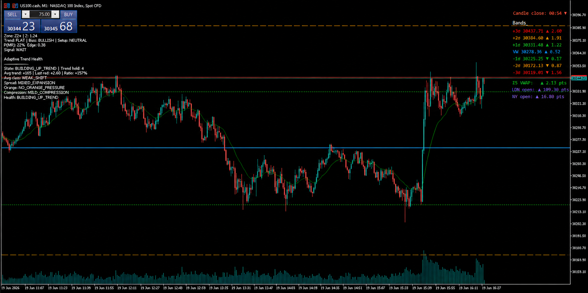
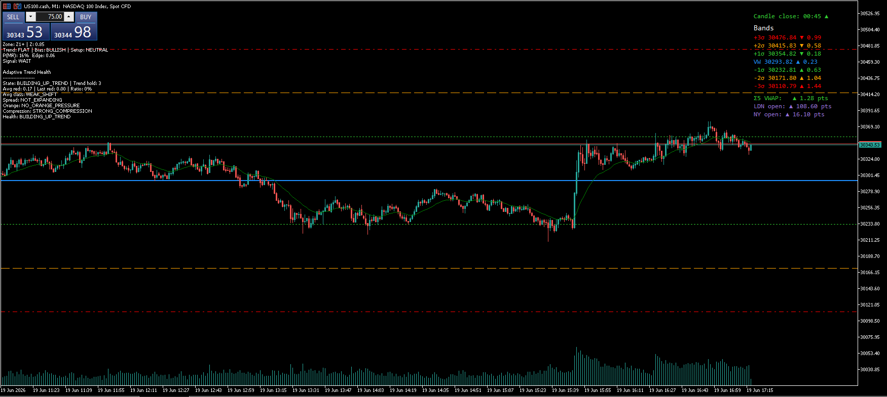

# VWAP-probability-band-engine

Intraday VWAP probability-band research framework for historical calibration, no-lookahead replay, live MT5 monitoring, and automated strategy backtesting.

This project studies how intraday Nasdaq / US100 price behaves around a session-reset VWAP/TWAP reference line and converts that behaviour into a structured research pipeline: probability bands, z-score zones, empirical mean-reversion / continuation probabilities, contextual filters, live overlay state, and automated backtest runners.

The repository now contains two connected layers:

1. **Discretionary probability engine** — VWAP bands, probability state, Adaptive Trend Health, replay validation, and live MT5 overlay monitoring.
2. **Automated execution research layer** — fixed-rule continuation strategy notebooks, configurable risk controls, trade logs, skipped-signal logs, daily summaries, multi-dataset comparisons, and a current V5 modular engine.

The project is research-focused. It does not automatically place live trades.

## Current Project Scope

The engine has evolved from a VWAP probability-band overlay into a broader intraday strategy research environment.

It now supports:

- historical VWAP/TWAP probability-band calibration,
- z-score zone classification,
- mean-reversion / continuation / neutral outcome labelling,
- context modelling using trend, volume, time-of-day, and z-score velocity,
- replay testing without look-ahead bias,
- live MT5 monitoring through generated MQL5 overlays,
- Adaptive Trend Health for discretionary trend-quality assessment,
- automated continuation-strategy research,
- versioned automated strategy notebooks from V1 to V5,
- a current V5 modular automated engine,
- fixed Nasdaq-point execution simulation,
- stop loss, take profit, breakeven, and daily risk-control modelling,
- optional runner-mode / exit-management research,
- trade-log, skipped-signal, daily-summary, and config-snapshot exports,
- multi-dataset comparison across calm, volatile, Ukraine-war, recent, 30-day, and 1-year Nasdaq regimes.

The long-term purpose is to develop a modular research workflow where each strategy idea can be isolated, tested, compared, and later promoted into a cleaner `.py` execution/backtest engine if it proves robust.

## Current Main Notebook

The current main automated strategy notebook is:

    notebooks/automated_vwap_v5_modular_engine.ipynb

This is the latest modular engine and should be treated as the primary automated backtest runner.

Earlier automated notebooks are kept for research history and version isolation. They are useful for understanding how the strategy evolved, but V5 is the current combined engine.

## Live MT5 Overlay

The live MT5 overlay displays VWAP probability bands, z-score/zone context, mean-reversion probability, continuation probability, signal state, session distance, volume behaviour, and Adaptive Trend Health directly on the trading chart.



The overlay is designed for discretionary monitoring and research validation. It does not automatically place trades.

### Full Band View

The full-band view shows the wider VWAP probability structure, including outer sigma bands, VWAP, session distance, and the live probability/state panel.



## Intraday VWAP Probability Bands Under Discrete-Time Market Data

This project studies how intraday price behaves relative to a session-reset reference line, usually VWAP, and whether deviations from that reference historically tend to mean-revert, continue, or remain neutral. It combines intraday data loading, VWAP / sigma band construction, z-score normalisation, empirical probability calibration, filtered signal generation, replay stepping, and live MT5 monitoring in one structured Python repository.

The benchmark motivation comes from lecture material on TWAP and VWAP in stochastic control and algorithmic trading at King’s College London. The theoretical benchmark framing is continuous-time, but the engine implemented here is **discrete-time** and runs bar by bar on intraday candles. The lecture notes motivate the move from TWAP to VWAP as a more meaningful execution benchmark when market volume matters.

In continuous time,

$$
\mathrm{TWAP} = \frac{1}{T}\int_0^T S_t\,dt
$$

and

$$
\mathrm{VWAP} = \frac{\int_0^T V_t S_t\,dt}{\int_0^T V_t\,dt},
$$

where $S_t$ is price and $V_t$ is market volume or order-flow intensity.

Although the benchmark motivation is naturally introduced in continuous time, the engine in this repository is implemented in **discrete time** on intraday candles. In practice, the reference line is updated bar by bar within each session.

For a session-reset VWAP, the implemented form is

$$
\mathrm{VWAP}_t = \frac{\sum_{i=\mathrm{open}}^{t} P_i^{\mathrm{typical}} V_i}{\sum_{i=\mathrm{open}}^{t} V_i},
$$

where the typical price is

$$
P_i^{\mathrm{typical}} = \frac{H_i + L_i + C_i}{3},
$$

where $H_i$, $L_i$, and $C_i$ denote the high, low, and close of bar $i$.

This is the discrete-time analogue of the continuous-time VWAP benchmark, with the summation taken over observed bars from the session open up to time $t$.

When volume is unavailable or unreliable, the engine can instead use a TWAP-style fallback:

$$
\mathrm{TWAP}_t = \frac{1}{t}\sum_{i=\mathrm{open}}^{t} P_i^{\mathrm{typical}}.
$$

So while the lecture-theory framing begins with integrals, the code in this project works entirely with cumulative summations and recursive bar-by-bar updates. This discrete formulation is what drives the reference line, sigma bands, z-scores, and live state transitions throughout the repository.

This project does **not** solve the full optimal execution problem from stochastic control. Instead, it uses VWAP as an intraday reference line, builds volatility bands around it, and studies whether deviations from that reference historically tend to:

1. revert back toward the mean,
2. continue further in the same direction, or
3. do neither clearly.

## Project Overview

Starting from the session reference line, the engine estimates an intraday volatility scale and builds probability bands around that reference. These bands convert raw price distance into a standardised state representation that can be compared across bars, sessions, and instruments.

The sigma-band structure is

$$
\mathrm{Band}_{k,\pm}(t) = \mathrm{Reference}_t \pm k\sigma_t,
\qquad k \in \{1,2,3\}.
$$

The price deviation is then normalised into a dimensionless z-score:

$$
z_t = \frac{C_t - \mathrm{Reference}_t}{\sigma_t}.
$$

This turns raw price behaviour into an instrument-agnostic state representation. The z-score is discretised into zones such as `Z3-`, `Z2-`, `Z1-`, `Z0`, `Z1+`, `Z2+`, `Z3+`, and these zones are combined with contextual features such as trend, volume regime, time-of-day, and z-score velocity.

Historical data is then used to estimate empirical probabilities of the form

$$
P(\mathrm{Outcome}\mid \mathrm{Zone}, \mathrm{Context}),
$$

where the outcome is one of:
- mean reversion (`MR`)
- continuation (`CONT`)
- neutral (`NEU`)

The project then studies how these probabilities can be converted into filtered trading signals for replay and live monitoring.

## Key Questions

This repository investigates the following core questions:

1. **Does intraday price extension relative to session VWAP contain a stable empirical mean-reversion edge?**
2. **How much does that edge depend on contextual features such as trend, volume regime, and time-of-day?**
3. **Can historical zone probabilities be converted into a practical signal layer with risk-aware filters?**
4. **Does the same engine structure remain usable across backtest, replay, and live MT5 workflows?**

## What the Engine Does

The project is built around six main layers.

### 1. Reference-line construction
The engine computes an intraday mean reference line, usually VWAP, with session reset logic.

### 2. Volatility and sigma bands
It estimates a volatility scale around the reference line and constructs $\pm 1\sigma$, $\pm 2\sigma$, and $\pm 3\sigma$ bands.

For the EWMA-style update, the variance recursion takes the form

$$
\sigma_t^2 = (1-\lambda)r_t^2 + \lambda \sigma_{t-1}^2,
$$

where $r_t$ is deviation from the reference rather than raw close-to-close return.

### 3. Z-score and zone classification
It converts price deviation into z-scores and discrete extension zones.

### 4. Context modelling
It computes contextual regime features such as:
- trend direction,
- volume regime,
- time-of-day bucket,
- z-score velocity.

### 5. Historical probability calibration
It labels historical outcomes and estimates zone-level or zone-plus-context probabilities using Wilson confidence intervals and fallback logic.

### 6. Signal generation
It produces typed signals such as:
- `MR_LONG`
- `MR_SHORT`
- `CONT_LONG`
- `CONT_SHORT`
- `NO_SIGNAL`

and filters them using:
- edge-gap thresholds,
- session warmup,
- minimum $|z|$,
- accepted zones,
- regime compatibility,
- time-of-day filters.

### 7. Adaptive Trend Health

The live MT5 overlay also includes an Adaptive Trend Health layer. This is a discretionary context module rather than an automated entry trigger. Its purpose is to describe whether the current market is trending cleanly, whether the trend is expanding, and whether continuation conditions are strengthening or weakening.

The trend-health logic separates three ideas:

1. **Trend existence** — determined by price holding the correct side of VWAP while the relevant green/orange bands continue to shift in the trend direction.
2. **Trend strength** — determined by the red band shifting in the direction of the trend.
3. **Spread/expansion quality** — determined by the opposite red band moving away while total band width expands.

For bullish conditions, the engine monitors whether price is above VWAP, VWAP is rising, upper green/orange are not meaningfully shifting down, and the upper red band is shifting upward.  
For bearish conditions, it monitors whether price is below VWAP, VWAP is falling, lower green/orange are not meaningfully shifting up, and the lower red band is shifting downward.

Orange-band touches are treated as impulse or extension pressure, not as automatic trend-ending signals.

#### Directional red-band shift

Trend strength is measured using the red band moving in the direction of the active trend.

For an upward trend:

$$
D_t^{up} = \max(B_{3,+}(t) - B_{3,+}(t-1), 0)
$$

For a downward trend:

$$
D_t^{down} = \max(B_{3,-}(t-1) - B_{3,-}(t), 0)
$$

The panel displays:

$$
\text{Ratio}_t =
\frac{\text{Last red shift}_t}{\text{Average red shift}_t}.
$$

The current default thresholds are:

| Component | Value |
|---|---:|
| Building trend | 3 qualifying candles |
| Confirmed trend | 7 qualifying candles |
| Established trend | 11 qualifying candles |
| Extended trend | 16 qualifying candles |
| Trend break tolerance | 5 bad candles |
| Red shift baseline window | 7 candles |
| Current red shift window | 1 candle |
| Orange pressure window | 10 candles |
| Compression tolerance | 0.25 |
| Lane shift tolerance | 0.25 |

Directional red-band shift strength is classified as:

| Red-band shift | Label |
|---:|---|
| 40+ | `EXTREME_EVENT_SHIFT` |
| 20+ | `VERY_HIGH_VOL_SHIFT` |
| 12+ | `VERY_STRONG_SHIFT` |
| 8+ | `STRONG_SHIFT` |
| 5+ | `GOOD_SHIFT` |
| 3+ | `MINIMUM_SHIFT` |
| < 3 | `WEAK_SHIFT` |

Expansion is classified as:

| Spread count over current window | Label |
|---:|---|
| 3 | `STRONG_EXPANSION` |
| 2 | `EXPANDING` |
| 1 | `MIXED_EXPANSION` |
| 0 | `NOT_EXPANDING` |

The MT5 overlay displays this as a separate left-panel block below the current signal table:

```text
Adaptive Trend Health
---------------------
State: CONFIRMED_DOWN_TREND | Trend hold: 9
Avg red: 12.40 | Last red: 10.80 | Ratio: 87%
Avg class: VERY_STRONG_SHIFT
Spread: EXPANDING
Orange: STRONG_ORANGE_PRESSURE
Compression: NONE
Health: VERY_STRONG_DOWN_TREND
```
`Trend hold` counts how many recent candles have held the adaptive trend structure, not how many candles are green/red or how many candles are strictly between green and orange.
`Avg red` is the median directional red-band shift over recent qualifying trend-lane candles.  
`Last red` is the most recent closed candle’s directional red-band shift.  
`Ratio` is `Last red / Avg red`.

## Automated Strategy Research Layer

The automated layer is separate from the discretionary MT5 overlay.

The goal is to test whether parts of the VWAP Probability Band Engine can be converted into clear, rule-based execution models. Each automated notebook represents one strategy version, with its own config, trade simulator, risk controls, logs, and comparison output.

The automated notebooks do not connect to MT5 and do not place live trades. They are historical backtest and strategy-research notebooks.

### Shared execution model

The automated notebooks use a fixed-point Nasdaq execution model:

| Component | Default |
|---|---:|
| Stop loss | 29 points |
| Take profit | 58 points |
| Breakeven trigger | +29 points |
| Risk per trade | 1% |
| Daily stop rule | stop after 2 consecutive daily losses |
| Daily profit cap | stop after +8% realised daily profit |
| Entry timing | next bar open |
| New-trade cutoff | 19:00 Europe/London |

The notebooks export research artifacts such as:

- trade logs,
- daily summaries,
- skipped-signal logs,
- config snapshots,
- multi-dataset comparison tables.

### Automated strategy versions

| Version | Notebook | Main idea |
|---|---|---|
| Research base | `notebooks/automated_execution_research.ipynb` | Exploratory notebook for testing whether discretionary VWAP setups can become rule-based execution logic. |
| V1 | `notebooks/automated_vwap_v1.ipynb` | Baseline continuation-only model using green reclaim / rejection logic. |
| V2 | `notebooks/automated_vwap_v2.ipynb` | V1-style continuation logic plus Adaptive Trend Health filtering. |
| V3 | `notebooks/automated_vwap_v3.ipynb` | Second-close green reclaim / rejection continuation setup. |
| V4 | `notebooks/automated_vwap_v4.ipynb` | Dynamic regime selector designed to route between continuation modules. |
| V4.5 | `notebooks/automated_vwap_v4_5.ipynb` | V4 regime selector plus conditional V2 trend-health safety filtering. |
| V5 | `notebooks/automated_vwap_v5_modular_engine.ipynb` | Current main automated engine. Modular strategy framework with V1/V2/V3/V4-style components, intelligent routing, optional manual module toggles, runner/exit-manager controls, richer diagnostics, skipped-signal logging, and experiment tracking. |

V5 is currently the main automated strategy notebook. Earlier notebooks are preserved as isolated research versions so that each idea can be tested independently before being combined into the modular engine.

## Automated VWAP V5 Modular Engine

`automated_vwap_v5_modular_engine.ipynb` is the current main automated backtest notebook.

V5 combines the earlier strategy experiments into a more modular research engine. Instead of treating V1, V2, V3, V4, and V4.5 as separate dead-end notebooks, V5 uses them as strategy components that can be toggled, routed, filtered, and compared.

The V5 engine includes:

- modular continuation-entry components,
- S-tier and A-tier continuation logic,
- optional Adaptive Trend Health filtering,
- dynamic regime-routing controls,
- manual module on/off switches,
- configurable red-shift entry floors,
- normal fixed SL / TP / breakeven settings,
- optional runner-mode logic,
- optional trailing / profit-lock research,
- skipped-signal diagnostics,
- trade-level output,
- daily-summary output,
- config snapshots,
- comparison runs across multiple historical datasets,
- automatic experiment logging.

The purpose of V5 is to act as the current research hub for the automated VWAP strategy. Earlier notebooks remain useful because they isolate individual ideas, but V5 is where the strongest combined version is currently being tested.

## Notebook Workflow

### Core research and discretionary workflow

#### `backtest_research.ipynb`

Main probability research notebook.

It:

- loads and checks historical data,
- builds the VWAP/TWAP reference line,
- constructs sigma bands,
- classifies z-score zones,
- computes context variables,
- labels mean-reversion / continuation / neutral outcomes,
- calibrates empirical probability tables,
- evaluates signal quality,
- plots overlays and probability heatmaps,
- exports research artifacts.

#### `replay_python.ipynb`

No-lookahead replay notebook.

It steps through historical data one bar at a time using only information that would have been available at that candle. This is used to validate live-style state transitions before relying on the MT5 overlay.

#### `live_trading.ipynb`

Live MT5 monitoring notebook.

It:

- connects to MT5,
- loads or exports live-use artifacts,
- runs the live engine,
- writes live JSON state,
- generates the MQL5 overlay source file.

#### `live_trading_double_overlay.ipynb`

Extended live-monitoring notebook for double-overlay experimentation.

This is used for testing richer MT5 display workflows without changing the core research notebooks.

### Automated execution workflow

#### `automated_execution_research.ipynb`

Exploratory automated-execution research notebook.

This notebook investigates whether the discretionary VWAP probability model can be converted into rule-based execution logic. It is used to prototype green reclaim / rejection entries, fixed-point execution, daily risk controls, skipped-signal logs, and strategy-filter comparisons.

#### `automated_vwap_v1.ipynb`

Baseline automated continuation runner.

V1 tests the first simple continuation-only setup.

#### `automated_vwap_v2.ipynb`

Trend-health-filtered continuation runner.

V2 keeps the V1-style continuation idea but adds Adaptive Trend Health filtering before accepting trades.

#### `automated_vwap_v3.ipynb`

Second-close continuation runner.

V3 tests whether waiting for a second completed close back inside the green trend zone improves entry quality.

#### `automated_vwap_v4.ipynb`

Dynamic regime-selection runner.

V4 introduces the idea of routing between different continuation modules depending on market regime.

#### `automated_vwap_v4_5.ipynb`

Dynamic regime-selection runner with conditional safety filtering.

V4.5 extends V4 by adding conditional V2 trend-health protection.

#### `automated_vwap_v5_modular_engine.ipynb`

Current main automated strategy notebook.

V5 is the modular engine that combines the strongest ideas from the previous versions. It supports module toggles, intelligent routing, configurable entry filters, V2 trend-health controls, S-tier / A-tier diagnostics, runner-mode settings, exit-management controls, skipped-signal analysis, multi-dataset comparison, and automatic experiment logging.

## Usage Modes

| Mode | Main files | Purpose |
|---|---|---|
| Probability research | `notebooks/backtest_research.ipynb`, `src/calibration.py`, `src/labelling.py`, `src/zones.py` | Build VWAP/TWAP bands, classify zones, label outcomes, and calibrate historical probabilities. |
| Replay validation | `notebooks/replay_python.ipynb`, `src/replay.py` | Step through historical candles without look-ahead bias and validate state transitions. |
| Live MT5 monitoring | `notebooks/live_trading.ipynb`, `src/live_runner.py`, `src/mql5_overlay.py` | Export live state and display VWAP bands, signal context, and Adaptive Trend Health on MT5. |
| Double-overlay live testing | `notebooks/live_trading_double_overlay.ipynb` | Test richer live MT5 display workflows. |
| Automated execution research | `notebooks/automated_execution_research.ipynb` | Prototype rule-based entries, execution assumptions, risk controls, and filter comparisons. |
| Versioned automated backtests | `notebooks/automated_vwap_v1.ipynb` to `notebooks/automated_vwap_v4_5.ipynb` | Compare isolated automated strategy versions across multiple historical regimes. |
| Current automated engine | `notebooks/automated_vwap_v5_modular_engine.ipynb` | Main modular automated VWAP backtest runner combining the strongest continuation, filtering, routing, runner, logging, and diagnostic ideas. |

The live overlay is intended as a discretionary decision-support tool. The automated notebooks are historical research/backtest tools. Neither layer currently places live trades automatically.

## Setup Guide

Clone the repository:

```bash
git clone https://github.com/MichaelMorgante/VWAP-probability-band-engine.git
cd VWAP-probability-band-engine
```

Create and activate a virtual environment:

```bash
python -m venv .venv
.venv\Scripts\activate
```

Install dependencies:

```bash
pip install -r requirements.txt
```

For live MT5 usage, MetaTrader 5 must be installed and logged in to the account or data feed being used. The Python environment also needs access to the `MetaTrader5` package from `requirements.txt`.

## Running the Project

### 1. Research / backtest workflow

Open:

```text
notebooks/backtest_research.ipynb
```

This notebook is used to:

* load historical intraday data,
* compute VWAP/TWAP references and sigma bands,
* classify z-score zones,
* label mean-reversion / continuation / neutral outcomes,
* calibrate empirical probability tables,
* evaluate signal quality,
* export research artifacts.

### 2. Replay workflow

Open:

```text
notebooks/replay_python.ipynb
```

This notebook replays historical data bar by bar. It is useful for checking that the engine behaves consistently without look-ahead bias.

### 3. Live MT5 workflow

Open:

```text
notebooks/live_trading.ipynb
```

The live workflow:

1. connects to MT5,
2. loads or exports live-use artifacts,
3. runs the live engine,
4. writes the latest state to `live_artifacts/states/live_state.json`,
5. generates the MQL5 overlay source file,
6. displays VWAP bands, signal context, and Adaptive Trend Health on MT5.

After generating the overlay, compile the generated `.mq5` file in MetaEditor and attach it to the relevant MT5 chart.

### 4. Automated strategy research workflow

Open:

    notebooks/automated_vwap_v5_modular_engine.ipynb

This is the current main automated VWAP backtest runner.

Use this notebook to:

- choose the dataset,
- select the strategy preset,
- toggle strategy modules,
- test normal fixed SL / TP / breakeven behaviour,
- test optional runner-mode behaviour,
- compare results across historical regimes,
- inspect trade logs,
- inspect skipped-signal logs,
- save experiment metadata.

Earlier automated notebooks are kept for version isolation:

    notebooks/automated_vwap_v1.ipynb
    notebooks/automated_vwap_v2.ipynb
    notebooks/automated_vwap_v3.ipynb
    notebooks/automated_vwap_v4.ipynb
    notebooks/automated_vwap_v4_5.ipynb

These earlier notebooks are useful for checking whether a new V5 result is genuinely coming from the combined modular logic or from one specific inherited component.

## Key Live Outputs

The live engine writes a JSON state file containing values such as:

| Field type            | Examples                                                                                                     |
| --------------------- | ------------------------------------------------------------------------------------------------------------ |
| Reference / bands     | VWAP/TWAP, sigma bands, z-score, zone                                                                        |
| Signal context        | signal type, signal display, bias, setup type, suppression reason                                            |
| Probability context   | mean-reversion probability, continuation probability, edge gap                                               |
| Adaptive Trend Health | trend state, trend hold, average red shift, last red shift, spread state, orange pressure, compression state |

The MQL5 overlay reads this JSON file and displays the live state directly on the MT5 chart.

## Automated Backtest Outputs

The automated notebooks save version-specific outputs under `artifacts/`.

Typical outputs include:

| Output | Purpose |
|---|---|
| Trade log | Every simulated trade, including side, entry, exit, result, R-multiple, and exit reason. |
| Daily summary | Daily realised performance, useful for checking loss streaks and FTMO-style daily risk behaviour. |
| Skipped-signal log | Raw setups that were rejected by filters, useful for debugging whether a filter is too strict. |
| Config snapshot | The exact strategy settings used for that run. |
| Experiment log | Saved record of which settings produced which results. |
| Comparison table | Strategy results across multiple datasets and market regimes. |

This is designed so that different strategy versions can be tested without losing track of which settings produced which result.

## Configuration Notes

Most key parameters are controlled in:

```text
src/config.py
```

Important groups include:

| Config group          | Purpose                                                                            |
| --------------------- | ---------------------------------------------------------------------------------- |
| Reference settings    | VWAP/TWAP choice and session reset behaviour                                       |
| Sigma settings        | Volatility-band construction                                                       |
| Context settings      | Trend, bias, volume, and time-of-day context                                       |
| Signal settings       | Edge thresholds, warmup rules, accepted zones, and filtering                       |
| Adaptive Trend Health | Trend-hold bars, red-band shift thresholds, expansion logic, compression tolerance |

Adaptive Trend Health is intentionally configurable because the useful thresholds can vary by instrument, session, volatility regime, and trading style.

## Historical Datasets

The repository includes multiple US100 / Nasdaq M1 historical datasets for testing strategy behaviour across different regimes.

Examples include:

| Dataset | Intended use |
|---|---|
| `US100_cash_M1_NY_session_30d.csv` | Short recent sample for quick iteration. |
| `US100_cash_M1_NY_session_1y.csv` | Broader one-year validation set. |
| `US100_cash_M1_NY_session_calm_2021_partial.csv` | Calm-regime testing. |
| `US100_cash_M1_NY_session_volatile_2022.csv` | Volatile-regime testing. |
| `US100_cash_M1_NY_session_ukraine_war_2022_2023.csv` | Stress / event-regime testing. |
| `US100_cash_M1_NY_session_recent_2025_2026.csv` | Recent-market validation. |
| `us100_cash_M1_new_york_2023_01_01_to_2024_01_01.csv` | Full-year New York session data. |
| `us100_cash_M1_new_york_2024_01_01_to_2025_01_01.csv` | Full-year New York session data. |

The purpose of using multiple datasets is to check whether a strategy only works in one recent sample or remains stable across calm, volatile, event-driven, and recent regimes.

## Strategy Research Philosophy

The automated notebooks are intentionally versioned.

Instead of constantly editing one notebook and losing track of what changed, each major idea is isolated first:

- V1 tests the simplest continuation baseline.
- V2 tests whether Adaptive Trend Health improves that baseline.
- V3 tests whether waiting for a second close improves continuation quality.
- V4 tests regime-based routing.
- V4.5 tests regime routing with extra trend-health safety.
- V5 combines the strongest ideas into one modular engine.

This workflow makes it easier to answer:

- Did the new rule actually improve the strategy?
- Did it improve returns but damage drawdown?
- Did it reduce bad trades or block good runners?
- Does it work across multiple datasets or only one sample?
- Is the result coming from the entry logic, the filter, the runner, or the risk controls?

The aim is not to curve-fit one perfect backtest. The aim is to build a research process where strategy components can be compared, retired, reused, or promoted into a cleaner production-style engine.

## Limitations

- This project is for research, replay, and discretionary live monitoring.
- Signal outputs are not guaranteed trading recommendations.
- Live behaviour depends on data quality, broker/server timestamps, spreads, slippage, session definitions, and market regime.
- Adaptive Trend Health is a rule-based context layer and should be validated against historical and live observations before being used in decision-making.
- Backtest and replay results may not match live trading exactly due to execution costs, latency, and changing market conditions.
- Automated notebook results are historical simulations and depend on the selected dataset, spread assumptions, candle data quality, entry timing, and the fixed-point execution model.
- The V5 modular engine is still a research notebook, not a production trading bot.
- Runner-mode and exit-management tests should be interpreted separately from entry-quality tests.
- Strong results on one historical regime do not guarantee robustness across future regimes.
- The live MT5 overlay is discretionary decision support and does not automatically execute trades.


## Repository Structure

```text
VWAP-probability-band-engine/
├── artifacts/
│   ├── automated_vwap_v5_modular_engine/
│   ├── logs/
│   ├── metadata/
│   ├── plots/
│   ├── report_charts/
│   └── tables/
├── data/
│   ├── historical/
│   └── snapshots/
├── docs/
│   └── images/
│       ├── mt5-live-overlay-volume-spike.png
│       └── mt5-full-bands-view.png
├── live_artifacts/
├── docs/
│   └── images/
├── notebooks/
│   ├── automated_execution_research.ipynb
│   ├── automated_vwap_v1.ipynb
│   ├── automated_vwap_v2.ipynb
│   ├── automated_vwap_v3.ipynb
│   ├── automated_vwap_v4.ipynb
│   ├── automated_vwap_v4_5.ipynb
│   ├── automated_vwap_v5_modular_engine.ipynb
│   ├── backtest_research.ipynb
│   ├── live_trading.ipynb
│   ├── live_trading_double_overlay.ipynb
│   └── replay_python.ipynb
├── src/
│   ├── __init__.py
│   ├── adaptive_trend_health.py
│   ├── calibration.py
│   ├── config.py
│   ├── context_overlay.py
│   ├── context.py
│   ├── engine.py
│   ├── evaluation.py
│   ├── exports.py
│   ├── labelling.py
│   ├── live_runner.py
│   ├── loaders.py
│   ├── lookup.py
│   ├── mql5_overlay.py
│   ├── plotting.py
│   ├── reference.py
│   ├── replay.py
│   ├── session_times.py
│   ├── sigma.py
│   ├── signals.py
│   ├── splits.py
│   ├── startup.py
│   ├── walk_forward.py
│   └── zones.py
├── tests/
├── .gitignore
├── LICENSE
├── README.md
└── requirements.txt
```

## License

This repository is provided under an **All Rights Reserved** license. No use, copying, modification, distribution, or derivative works are permitted without prior written permission.
See the [LICENSE](LICENSE) file for details.